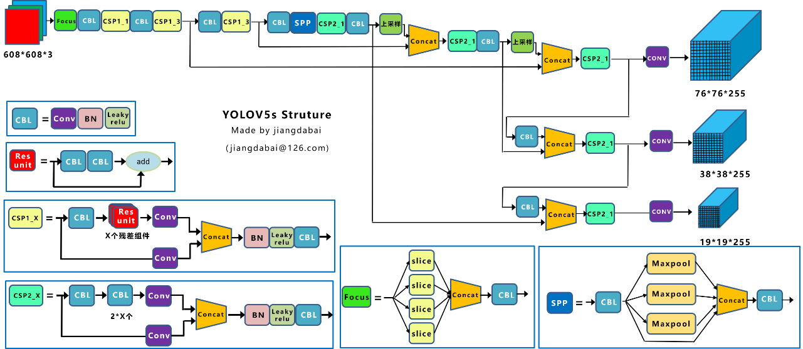
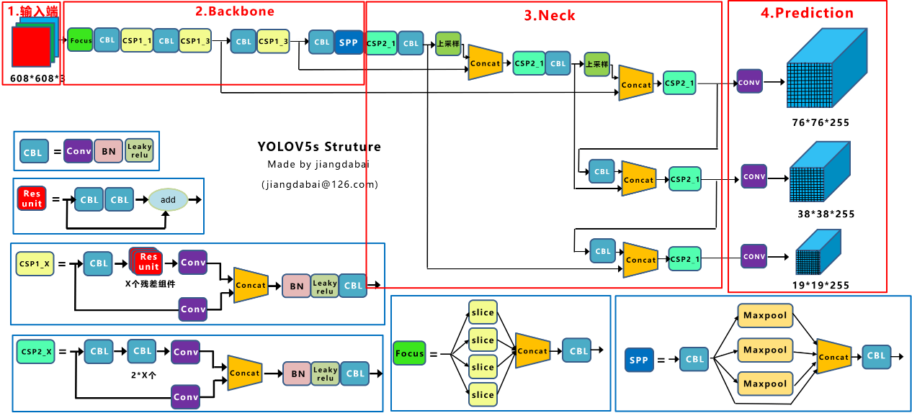
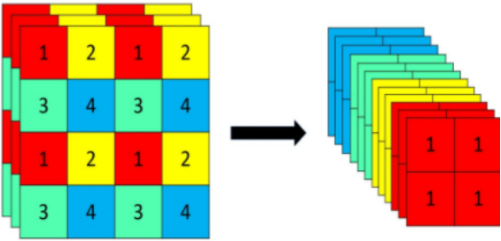

# An object Detection method based on YOLOv5

<div align="center">
<p>
   <a align="left" href="https://ultralytics.com/yolov5" target="_blank">
   </a>
</p>
<br>
<div>
   <a href="https://github.com/ultralytics/yolov5/actions"></a>
   <a href="https://zenodo.org/badge/latestdoi/264818686"></a>
   <a href="https://hub.docker.com/r/ultralytics/yolov5"></a>
   <br>
   <a href="https://colab.research.google.com/github/ultralytics/yolov5/blob/master/tutorial.ipynb"></a>
   <a href="https://www.kaggle.com/ultralytics/yolov5"></a>
   <a href="https://join.slack.com/t/ultralytics/shared_invite/zt-w29ei8bp-jczz7QYUmDtgo6r6KcMIAg"></a>
</div>
<br>
<div align="center">
   <a href="https://github.com/ultralytics">
   
   </a>
   
   <a href="https://www.linkedin.com/company/ultralytics">
   
   </a>
   
   <a href="https://twitter.com/ultralytics">
   
   </a>
   
   <a href="https://youtube.com/ultralytics">
   
   </a>
   
   <a href="https://www.facebook.com/ultralytics">
   
   </a>
   
   <a href="https://www.instagram.com/ultralytics/">
   
   </a>
</div>

<br>
<p>
YOLOv5 🚀 is a family of object detection architectures and models pretrained on the COCO dataset, and represents <a href="https://ultralytics.com">Ultralytics</a>
 open-source research into future vision AI methods, incorporating lessons learned and best practices evolved over thousands of hours of research and development.
</p>
<!-- 
<a align="center" href="https://ultralytics.com/yolov5" target="_blank">
</a>
-->

</div>

## <div align="center">Documentation</div>

See the [YOLOv5 Docs](https://docs.ultralytics.com) for full documentation on training, testing and deployment.

## <div align="center">Quick Start Examples</div>

<details open>
<summary>Install</summary>

[**Python>=3.6.0**](https://www.python.org/) is required with all
[requirements.txt](https://github.com/ultralytics/yolov5/blob/master/requirements.txt) installed including
[**PyTorch>=1.7**](https://pytorch.org/get-started/locally/):
<!-- $ sudo apt update && apt install -y libgl1-mesa-glx libsm6 libxext6 libxrender-dev -->

```bash
$ git clone https://github.com/ultralytics/yolov5
$ cd yolov5
$ pip install -r requirements.txt
```

</details>

<details open>
<summary>Inference</summary>

Inference with YOLOv5 and [PyTorch Hub](https://github.com/ultralytics/yolov5/issues/36). Models automatically download
from the [latest YOLOv5 release](https://github.com/ultralytics/yolov5/releases).

```python
import torch

# Model
model = torch.hub.load('ultralytics/yolov5', 'yolov5s')  # or yolov5m, yolov5l, yolov5x, custom

# Images
img = 'https://ultralytics.com/images/zidane.jpg'  # or file, Path, PIL, OpenCV, numpy, list

# Inference
results = model(img)

# Results
results.print()  # or .show(), .save(), .crop(), .pandas(), etc.
```

</details>


<details>
<summary>Inference with detect.py</summary>

`detect.py` runs inference on a variety of sources, downloading models automatically from
the [latest YOLOv5 release](https://github.com/ultralytics/yolov5/releases) and saving results to `runs/detect`.

```bash
$ python detect.py --source 0  # webcam
                            file.jpg  # image 
                            file.mp4  # video
                            path/  # directory
                            path/*.jpg  # glob
                            'https://youtu.be/NUsoVlDFqZg'  # YouTube
                            'rtsp://example.com/media.mp4'  # RTSP, RTMP, HTTP stream
```

</details>

<details>
<summary>Training</summary>

Run commands below to reproduce results
on [COCO](https://github.com/ultralytics/yolov5/blob/master/data/scripts/get_coco.sh) dataset (dataset auto-downloads on
first use). Training times for YOLOv5s/m/l/x are 2/4/6/8 days on a single V100 (multi-GPU times faster). Use the
largest `--batch-size` your GPU allows (batch sizes shown for 16 GB devices).

```bash
$ python train.py --data coco.yaml --cfg yolov5s.yaml --weights '' --batch-size 64
                                         yolov5m                                40
                                         yolov5l                                24
                                         yolov5x                                16
```


</details>  

1 硬件配置说明

1.1 计算平台

| ***\*GPU\****          | 128-core Maxwell                                           |
| ---------------------- | ---------------------------------------------------------- |
| ***\*CPU\****          | Quad-core ARM A57@1.43GHz                                  |
| ***\*Memory\****       | 4GB 64-bit LPDDR4 25.6GB/s                                 |
| ***\*Storage\****      | microSD(not included)                                      |
| ***\*Video Encode\**** | 4K@30\|4x 1080p @30\|9x 720p @30 (H.264/H.265)             |
| ***\*Video Decode\**** | 4K@60\|2x 4K @30\|8x 1080p @30\|18x 720p @30 (H.264/H.265) |
| ***\*Camera\****       | 1x MIPI CSI-2 DPHY lanes                                   |
| ***\*Connectivity\**** | Gigabit Ethernet, M.2 Key E                                |
| ***\*Display\****      | HDMI 2.0 and eDP 1.4                                       |
| ***\*USB\****          | 4x USB 3.0, USB 2.0 Micro-B                                |
| ***\*Others\****       | GPIO, I2C, I2S, SPI, UART                                  |
| ***\*Mechanical\****   | 69mm×45mm, 260-pin edge connector                          |

1.2 摄像头

摄像头使用大赛组委会规定 Intel SR300，具体参数如下：

| ***\*基本要素\****                                    |                         |
| ----------------------------------------------------- | ----------------------- |
| ***\*产品集\****                                      | 英特尔® 实感™ 摄像头    |
| ***\*状态\****                                        | Launched                |
| ***\*发行日期\****                                    | Q1'16                   |
| ***\*深度技术\****                                    | Coded Light             |
| ***\*操作规范\****                                    |                         |
| ***\*操作范围（最小\**** ***\*-\**** ***\*最大）\**** | 0.3m - 2m               |
| ***\*深度分辨率和 FPS\****                            | VGA 30fps               |
| ***\*视野深度\****                                    | H: 73, V: 59, D: 90     |
| ***\*补充信息\****                                    |                         |
| ***\*数据表\****                                      | 立即查看                |
| ***\*组件\****                                        |                         |
| ***\*RGB 传感器\****                                  | 是                      |
| ***\*跟踪模块\****                                    | 否                      |
| ***\*模块规格\****                                    |                         |
| ***\*尺寸\****                                        | 110mm x 12.5mm x 3.75mm |
| ***\*电源\****                                        | 1.8 W                   |
| ***\*系统接口类型\****                                | USB3                    |

2 软件环境配置

| ***\*操作系统\**** | Ubantu18.04 |
| ------------------ | ----------- |
| ***\*Python\****   | 3.8         |
| ***\*CUDA\****     | 10.2        |
| ***\*Pytorch\****  | 1.6.0       |
| ***\*Opecncv\****  | 4.5.1       |

3 视觉软件界面及功能说明

（界面高清截图+功能介绍）图1


4 主要算法

本次视觉项目所采用的主要算法为Yolov5，实现了对目标物品的检测与识别，下面详细介绍其核心基础内容。

4.1 网络结构图

 

***\*图\*******\*2\**** Yolov5s网络结构图

在Yolov5的官方代码中，有四个版本的目标检测网络，其中Yolov5s网络深度最小、特征图宽度最小，其它三种则在此基础上不断加深加宽。本说明以Yolov5s为例，阐述其网络架构细节，其网络结构图如图2所示。

网络可划分为输入端、Backbone、Neck及Prediction部分，如图3所示。其中输入端包含Mosaic数据增强、自适应锚框计算与自适应图片缩放；Backbone包含Focus结构、CSP结构；Neck包含FPN＋PAN结构；Prediction则包含GIOU_LOSS损失函数。

 

***\*图\*******\*3\**** Yolov5s网络结构划分图

4.2 输入端

4.2.1 Mosaic数据增强

Yolov5的输入端采用了和Yolov4同样的数据增强方式，将四张图片通过随机缩放、随机裁剪及随机排布的方式进行拼接，从而大大丰富了数据集，尤其是随机缩放增加了很多小目标，让网络的鲁棒性更好更优越。另外，使用Mosaic增强训练时，可以直接计算四张图片的数据，使得只需要较小的Mini-batch，一个GPU即可达到较好的处理效果。

4.2.2 自适应锚框计算

在Yolo系列算法中，对于不同的数据集，都具备初始设定长宽的锚框。而在网络训练过程中，需要在初始锚框的基础上输出预测框，进而和真实框对比，计算两者差距后反向更新来迭代网络参数。在之前的Yolo系列算法中，计算初始锚框的值时通过单独的程序运行的；而Yolov5则是将计算过程嵌入到代码中，在每次训练时自适应地计算不同训练集中的最佳锚框值。

4.2.3 自适应图片缩放

在常用的目标检测算法中，不同的图片具有不同的长宽，因此常将原始图片统一缩放至相同的标准尺寸，再送入检测网络中。而Yolov5算法则对此进行了改进，对原始图像自适应地增添最少的黑边，减少信息冗余，加快速度。

4.3 Backbone

4.3.1 Focus结构

 

***\*图\*******\*4\**** 切片操作示意图

在Focus结构中，较为关键的是其切片操作，其原理与细节如图4所示。在Yolov5算法中，将原始图像输入Focus结构后得到输出特征图，再经过卷积层，得到最终特征图。

4.3.2 CSP结构

CSP能够从网络结构设计的角度解决推理计算量大的问题，采用CSP模块将基础层的特征映射划分成两部分，然后通过跨阶段层次结构将它们合并，从而既减少了计算量，又保证了准确率。

因此，Yolov5在主干网络中采用CSP结构，增强了CNN的学习能力，使其在轻量化的同时保持准确性，并降低了计算瓶颈与内存成本。

4.4 Neck

Yolov5和Yolov4类似，都采用了FPN+PAN的结构。其中，FPN是自顶向下的，将高层的特征信息通过上采样的方式进行传递融合，得到需要的特征图；而PAN结构则是自底向上的特征金字塔，两者结合从不同的主干层对不同的检测层进行参数聚合，进一步提高了特征提取的能力。但Yolov4的Neck结构中采用的是普通的卷积操作，而在Yolov5的Neck结构借鉴了CSP2，加强了网络特征融合的能力。

4.5 Prediction

目标检测任务的损失函数一般由Classification Loss即分类损失函数和Bounding Box Regression Loss即回归损失函数两部分构成。其中，本算法的Bounding Box Regression Loss采用GIOU_LOSS，该损失函数增加了相交尺度的衡量方式，即解决了边界框不重合时存在的问题。

5 视觉软件工作流程图

 

***\*图\*******\*5\**** 视觉软件工作流程图

图5为视觉软件工作流程图，当按下可视化界面的“开始”按钮后，即可通过摄像头采集图像，再输入进Yolov5网络，最后输出目标物品类别与数量并通过可视化界面显示。
